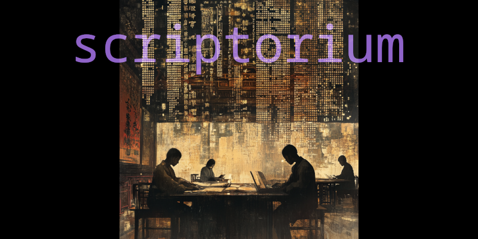

<div align="center">

[](https://github.com/kagemnikarimu/scriptorium/actions)
[](https://hub.docker.com/r/kagemnikarimu/scriptorium)
[](https://hub.docker.com/r/kagemnikarimu/scriptorium/tags)

</div>

# 🔮 scriptorium
the universal manuscript livebook &amp; learning center

# ✨ quick start
Pull and run the container directly:

```bash
docker run --rm -v /var/run/docker.sock:/var/run/docker.sock -p 8080:8080 -p 8081:8081 kagemnikarimu/scriptorium
```

After running the container, visit [http://localhost:8080/apps/scriptorium-intro](http://localhost:8080/apps/scriptorium-intro) to get started.
You will need to authenticate with the token given in the terminal for security reasons.

Note: Ports must be mapped to access:
- 8080: Main interface
- 8081: LiveBook server

`-v /var/run/docker.sock:/var/run/docker.sock` is required for Host Docker access to launch manuscripts.

# 🔬 build yourself

Clone and build locally:

```bash
# Clone the Repo
git clone https://github.com/kagemnikarimu/scriptorium
cd scriptorium

# Build the image locally
docker build -t scriptorium .

# Run the container with Docker socket access
docker run --rm \
  -v /var/run/docker.sock:/var/run/docker.sock \  # Gives access to host Docker
  -p 8080:8080 \                                  # Livebook web interface
  -p 8081:8081 \                                  # Livebook additional port
  scriptorium
  ```
